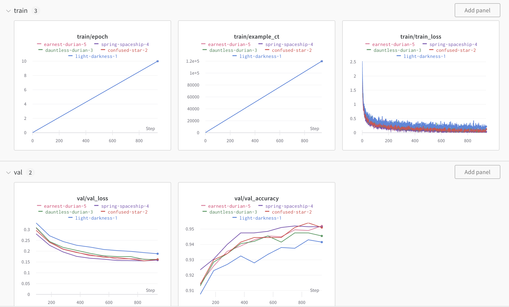

# wandb

```python
!pip install wandb -qU

import wandb
wandb.login()  # 登录，输入密钥
```

## 记录指标数据

```python
import random

# Launch 5 simulated experiments
total_runs = 5
for run in range(total_runs):
  # 🐝 1️⃣ Start a new run to track this script
  wandb.init(
      # Set the project where this run will be logged
      project="basic-intro", 
      # We pass a run name (otherwise it’ll be randomly assigned, like sunshine-lollypop-10)
      name=f"experiment_{run}", 
      # Track hyperparameters and run metadata
      config={
      "learning_rate": 0.02,
      "architecture": "CNN",
      "dataset": "CIFAR-100",
      "epochs": 10,
      })
  
  # This simple block simulates a training loop logging metrics
  epochs = 10
  offset = random.random() / 5
  for epoch in range(2, epochs):
      acc = 1 - 2 ** -epoch - random.random() / epoch - offset
      loss = 2 ** -epoch + random.random() / epoch + offset
      
      # 🐝 2️⃣ Log metrics from your script to W&B
      wandb.log({"acc": acc, "loss": loss})
      
  # Mark the run as finished
  wandb.finish()
```

跑5次实验，都在 `basic-intro` 这个project中；每次实验跑8个epoch，记录每次epoch的指标数据。


## 指标分区



```python
metrics = {"train/train_loss": train_loss, 
            "train/epoch": (step + 1 + (n_steps_per_epoch * epoch)) / n_steps_per_epoch, 
            "train/example_ct": example_ct}


# wandb.log(metrics)

val_metrics = {"val/val_loss": val_loss, 
                "val/val_accuracy": accuracy}

wandb.log({**metrics, **val_metrics})
```


## table


```python
def log_image_table(images, predicted, labels, probs):
    "Log a wandb.Table with (img, pred, target, scores)"
    # 🐝 Create a wandb Table to log images, labels and predictions to
    table = wandb.Table(columns=["image", "pred", "target"]+[f"score_{i}" for i in range(10)])
    for img, pred, targ, prob in zip(images, predicted, labels, probs):
        table.add_data(wandb.Image(img[0].numpy()*255), pred, targ, *prob.numpy())
    wandb.log({"predictions_table":table}, commit=False)
```

## summary


```python
# If you had a test set, this is how you could log it as a Summary metric
wandb.summary['test_accuracy'] = 0.8
```


