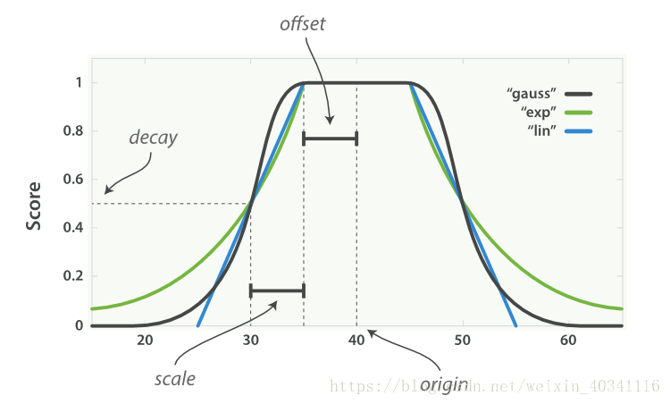

在使用 `Elasticsearch` 进行全文搜索时，搜索结果默认会以文档的相关度进行排序，如果想要改变默认的排序规则，也可以通过`sort`指定一个或多个排序字段。但是使用`sort`排序过于绝对，它会直接忽略掉文档本身的相关度（根本不会去计算）。在很多时候这样做的效果并不好，这时候就需要对多个字段进行综合评估，得出一个最终的排序。`Elasticsearch`提供了`function_score`功能来满足我们的需求。

# function\_score简介

在使用`ES`进行全文搜索时，搜索结果默认会以文档的相关度进行排序，而这个 “文档的相关度”，是可以透过 `function_score` 自己定义的，也就是说我们可以透过使用`function_score`，来控制 “怎麽样的文档相关度更高” 这件事。

-   `function_score`是专门用于处理文档`_score`的`DSL`，它允许为每个主查询`query`匹配的文档应用加强函数， 以达到改变原始查询评分 `score`的目的。
-   `function_score`会在主查询`query`结束后对每一个匹配的文档进行一系列的重打分操作，**能够对多个字段一起进行综合评估，且能够使用 ****`filter`**** 将结果划分爲多个子集 (每个特性一个**\*\*`filter`)，并为每个子集使用不同的加强函数。\*\*​

# function\_score参数

## 加强`_score`计算的函数

### weight

设置一个简单而不被规范化的权重提升值。
`weight`加强函数和 `boost`参数类似，可以用于任何查询，不过有一点差别是`weight`不会被`Lucene nomalize`成难以理解的浮点数，而是直接被应用 (`boost会被nomalize`)

> 例如当 `weight = 2` 时，最终结果爲`new_score = old_score * 2`

### field\_value\_factor

将某个字段的值乘上`old_score`。

像是将 字段`shareCount` 或是 字段`likiCount` 作爲考虑因素

> `new_score = old_score * 那个文档的likeCount的值`

```powershell
{ "title": "ES 入门", "like": 2 }
{ "title": "ES 进阶", "like": 5 }
{ "title": "ES 最高难度", "like": 10 }


GET 127.0.0.1/mytest/doc/_search
{
    "query": {
        "function_score": {
            "query": {
                "match": {
                    "title": "ES"
                }
            },
            "field_value_factor": {
                "field": "like"
            },
            "max_boost": 3            // like字段那些大于3的值就只能取3了
        }
    }
}
```

有时候线性的计算效果并不是那麽好，`field_value_factor`中还支持 `modifier`、`factor` 参数，可以改变like值对`old_score`的影响。

#### **modifier参数**

-   `none` : new\_score = old\_score \* like值          默认状态就是`none`，线性。
-   `log1p` : new\_score = old\_score \* log(1 + like值)       最常用，可以让like值字段的评分曲线更平滑。
-   `log2p` : new\_score = old\_score \* log(2 + like值)
-   `ln` : new\_score = old\_score \* ln(like值)
-   `ln1p` : new\_score = old\_score \* ln(1 + like值)
-   `ln2p` : new\_score = old\_score \* ln(2 + like值)
-   `square` : 计算平方
-   `sqrt` : 计算平方根
-   `reciprocal` : 计算倒数

#### **factor参数**

`factor`作为一个调节用的参数，没有`modifier`那麽强大会改变整个曲线，他仅改变一些常量值，

设置`factor>1会`提昇效果，`factor<1`会降低效果。

> 假设`modifier`是`log1p`，那麽加入了`factor`的公式就是
> `new_score = old_score * log(1 + factor * like值)`

```powershell
GET 127.0.0.1/mytest/doc/_search
{
    "query": {
        "function_score": {
            "query": {
                "match": {
                    "title": "ES"
                }
            },
            "field_value_factor": {
                "field": "like",
                "modifier": "log1p",
                "factor": 2
            }
        }
    }
}
```

### random\_score

爲每个用户都使用一个不同的随机评分对结果排序，但对某一具体用户来说，看到的顺序始终是一致的。

### 衰减函数 (linear、exp、guass)

以某个字段的值为基准，距离某个值越近得分越高。

很多变量都可以影响用户对于酒店的选择，像是用户可能希望酒店离市中心近一点，但是如果价格足够便宜，也愿意为了省钱，妥协选择一个更远的住处。如果我们只是使用一个 `filter` 排除所有市中心方圆 100 米以外的酒店，再用一个`filter`排除每晚价格超过100元的酒店，这种作法太过强硬，**可能有一间房在 500米，但是超级便宜一晚只要10元，用户可能会因此愿意妥协住这间房**。

为了解决这个问题，因此`function_score`查询提供了一组 `衰减函数 (decay functions)`， **让我们有能力在两个滑动标准(如地点和价格)之间权衡**。

```纯文本
function_score支持的衰减函数有三种，分别是 linear、exp 和 gauss。三种衰减函数的差别只在于衰减曲线的形状，在DSL的语法上的用法完全一样。

- linear : 线性函数是条直线，一旦直线与横轴0相交，所有其他值的评分都是0。
- exp : 指数函数是先剧烈衰减然后变缓。
- guass(最常用) : 高斯函数则是钟形的，他的衰减速率是先缓慢，然后变快，最后又放缓。
```

#### 参数

-   `origin` : 中心点，或是字段可能的最佳值，落在原点(origin)上的文档评分\_score为满分1.0，支持数值、时间 以及 “经纬度地理座标点”(最常用) 的字段。
-   `offset` : 从 origin 为中心，为他设置一个偏移量offset覆盖一个范围，在此范围内所有的评分\_score也都是和origin一样满分1.0。
-   `scale` : 衰减率，即是一个文档从origin下落时，\_score改变的速度。
-   `decay` : 从 origin 衰减到 scale 所得的评分\_score，默认为0.5 (一般不需要改变，这个参数使用默认的就好了)。



所有曲线(`linear、exp、gauss`)的`origin`都是40，`offset`是5，因此范围在`40-5 <= value <= 40+5`的文档的评分`_score`都是满分`1.0`。
而在此范围之外，评分会开始衰减，衰减率由`scale`值(此处是5)和`decay`值(此处是默认值0.5)决定，在`origin +/- (offset + scale)`处的评分是`decay`值，也就是在30、50的评分处是0.5分。
也就是说，在`origin + offset + scale`或是`origin - offset - scale`的点上，得到的分数仅有`decay`分。

#### 例子1

```powershell
{ "language": "java", "like": 5 }
{ "language": "python", "like": 10 }
{ "language": "go", "like": 15 }

GET 127.0.0.1/mytest/doc/_search
{
    "query": {
        "function_score": {
            "query": {
                "match_all": {}
            },
            "functions": [
                {
                    "gauss": {
                        "like": {
                            "origin": "15", //如果不设置offset，offset默认为0
                            "scale": "5",
                            "decay": "0.2"
                        }
                    }
                }
            ]
        }
    }
}
```

结果：

```powershell
"hits": [
    {
        "_score": 1,
        "_source": { "language": "go", "like": 15 }
    },
    {
        "_score": 0.2, //decay=0.2，位于origin-offset-scale=10的位置，分数为decay
        "_source": { "language": "python", "like": 10 }
    },
    {
        "_score": 0.0016,
        "_source": { "language": "java", "like": 5 }
    }
]
```

#### 例子2

假设有一个用户希望租一个离市中心近一点的酒店，且每晚不超过100元的酒店，而且与距离相比，我们的**用户对价格更敏感**，那麽使用衰减函数`guass`查询如下：

-   其中把price语句的origin点设为50是有原因的，由于价格的特性一定是越低越好，所以0\~100元的所有价格的酒店都应该认为是比较好的，而100元以上的酒店就慢慢衰减。
-   如果我们将price的origin点设置成100，那麽价格低于100元的酒店的评分反而会变低，这不是我们期望的结果，与其这样不如将origin和offset同时设成50，只让price大于100元时评分才会变低
-   虽然这样设置也会使得price小于0元的酒店评分降低没错，不过现实生活中价格不会有负数，因此就算price<0的评分会下降，也不会对我们的搜索结果造成影响(酒店的价格一定都是正的)。
-   换句话说，其实只要把origin + offset的值设为100，origin或offset是什麽样的值都无所谓，只要能确保酒店价格在100元以上的酒店会衰减就好了。

```powershell
GET 127.0.0.1/mytest/doc/_search
{
    "query": {
        "function_score": {
            "functions": [
                //第一个gauss加强函数，决定距离的衰减率
                {
                    "gauss": {
                        "location": {
                            "origin": {  //origin点设成酒店的经纬度座标
                                "lat": 51.5,
                                "lon": 0.12
                            },
                            "offset": "2km", //距离中心点2km以内都是满分1.0，2km外开始衰减
                            "scale": "3km"  //衰减率
                        }
                    }
                },
                //第二个gauss加强函数，决定价格的衰减率，因为用户对价格更敏感，所以给了这个gauss加强函数2倍的权重
                {
                    "gauss": {
                        "price": {
                            "origin": "50", 
                            "offset": "50",
                            "scale": "20"
                        }
                    },
                    "weight": 2
                }
            ]
        }
    }
}
```

### script\_score

当需求超出以上范围时，可以用自定义脚本完全控制评分计算，不过因为还要额外维护脚本不好维护，因此尽量使用ES提供的评分函数，需求真的无法满足再使用`script_score`。

```powershell
/POST {{host}}:{{port}}/demo/article/_search?search_type=dfs_query_then_fetch
{
"query": {
  "function_score": {
    "query": {
      "match": {"content": "测" }
     },
    "script_score": {
      "script": {
        "lang": "painless", 
        "source": "if(doc['content.keyword'].value.startsWith(params.keyword))return 1; return 0;", //此处更改为content.keyword
        "params":{ "keyword":"测" } }
    },
    "boost_mode": "sum"     
  }
 }
}

# 给测开头的语句加了1分
```

## 其他辅助函数

### boost\_mode

`boost_mode`决定 `old_score` 和 加强`score` 如何合并。

-   `multiply(默认)` : new\_score = old\_score \* 加强score
-   `sum` : new\_score = old\_score + 加强score
-   `min` : old\_score 和 加强score 取较小值，new\_score = min(old\_score, 加强score)
-   `max` : old\_score 和 加强score 取较大值，new\_score = max(old\_score, 加强score)
-   `replace` : 加强score直接替换掉old\_score，new\_score = 加强score

```powershell
GET 127.0.0.1/mytest/doc/_search
{
    "query": {
        "function_score": {
            "query": {
                "match": {
                    "title": "ES"
                }
            },
            "field_value_factor": {
                "field": "like",
                "modifier": "log1p",
                "factor": 0.1
            },
            "boost_mode": "sum"       //new_score = old_score + log(1 + 0.1 * like值)
        }
    }
}
```

### score\_mode

💗 先执行score\_mode，再执行boost\_mode

`score_mode`决定`functions`裡面的加强`score`们怎麽合併，会先合併加强score们成一个总加强score，再使用总加强score去和old\_score做合并。

-   `multiply (默认)`
-   `sum`
-   `avg`
-   `first` : 使用首个函数(可以有filter，也可以没有)的结果作为最终结果。
-   `max`
-   `min`

### max\_boost

`max_boost` : 限制加强函数的最大效果，就是限制加强score最大能多少，但要注意不会限制old\_score。

-   如果加强score超过了max\_boost限制的值，会把加强score的值设成max\_boost的值。
    > `加强score = min(加强score, max_boost)`

# function\_score查询模板

在一个`function_score`内部的`query`的全文搜索得到的`_score`基础上，给他加上其他字段的评分标准，就能够得到把 “全文搜索 + 其他字段” 综合起来评分的效果。

## 单个加强函数

```powershell
GET 127.0.0.1/mytest/doc/_search
{
    "query": {
        "function_score": {
            "query": {.....}, //主查询，查询完后这裡自己会有一个评分，就是old_score
            "field_value_factor": {...}, //在old_score的基础上，给他加强其他字段的评分，这裡会产生一个加强score，如果只有一个加强function时，直接将加强函数名写在query下面就可以了
            "boost_mode": "multiply", //指定用哪种方式结合old_score和加强score成为new_score
            "max_boost": 1.5 //限制加强score的最高分，但是不会限制old_score
        }
    }
}
```

## 多个加强函数

如果有多个加强函数，那就要使用`functions`来包含这些加强函数们，`functions`是一个数组，裡面放著的是将要被使用的加强函数列表。

可以为`functions`裡的加强函数指定一个`filter`，这样做的话，只有在文档满足此`filter`的要求，此`filter`的加强函数才会应用到文挡上，也可以**不指定`filter`，这样的话此加强函数就会应用到全部的文挡上。**

一个文档可以一次满足多条加强函数和多个`filter`，如果一次满足多个，那麽就会产生多个加强`score`，因此ES会使用`score_mode`定义的方式来合併这些加强score们，得到一个总加强score，得到总加强score之后，才会再使用`boost_mode`定义的方式去和`old_score`做合并。

```powershell
GET 127.0.0.1/mytest/doc/_search
{
    "query": {
        "function_score": {
            "query": {.....},
            "functions": [   //可以有多个加强函数(或是filter+加强函数)，每一个加强函数会产生一个加强score，因此functions会有多个加强score
                { "field_value_factor": ... },
                { "gauss": ... },
                { "filter": {...}, "weight": ... }
            ],
            "score_mode": "sum", //决定加强score们怎麽合併,
            "boost_mode": "multiply" //決定總加強score怎麼和old_score合併
        }
    }
}
```
