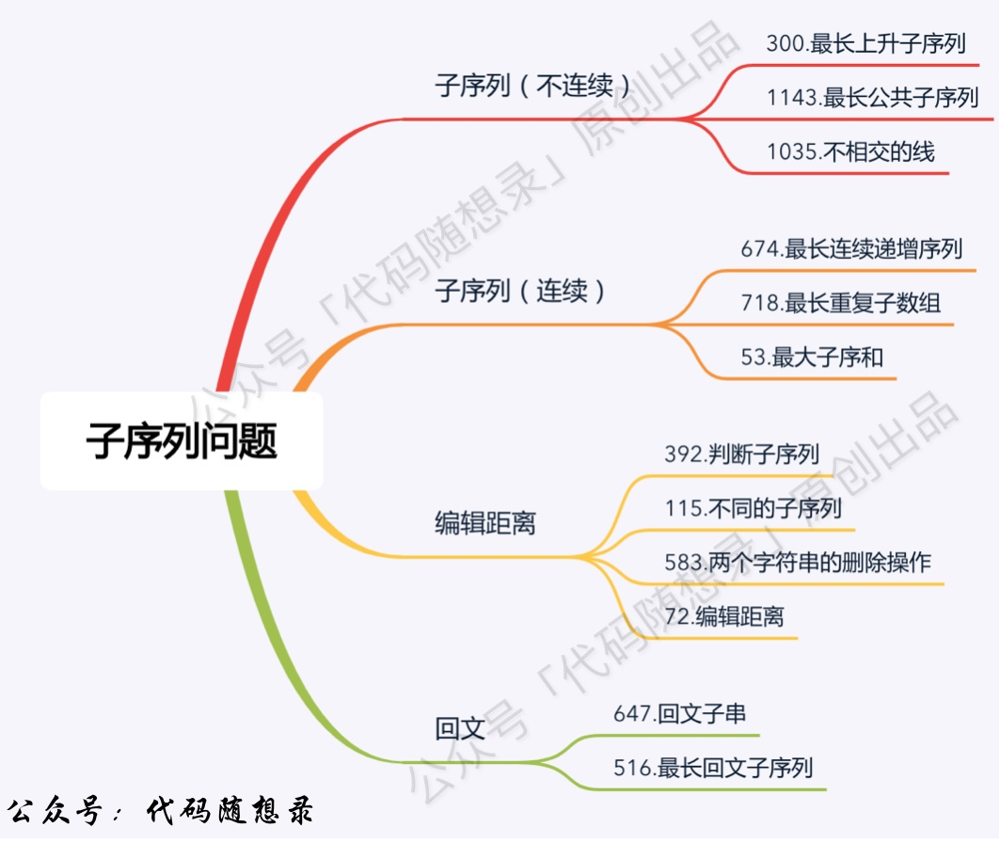

<https://labuladong.gitee.io/algo/3/24/>




# 1143. 最长公共子序列
https://leetcode-cn.com/problems/longest-common-subsequence/

输入：text1 = "abcde", text2 = "ace" 
输出：3  
解释：最长公共子序列是 "ace" ，它的长度为 3。

```python
class Solution:
    def longestCommonSubsequence(self, text1: str, text2: str) -> int:
        """
        DPtable: text1[:i] 和 text[:j] 的 LCS 值
        """
        m = len(text1)
        n = len(text2)
        dptable = [[0] * (n+1) for _ in range(m+1)]

        for i in range(1, m + 1):
            for j in range(1, n + 1):
                if text1[i-1] == text2[j-1]:
                    dptable[i][j] = dptable[i-1][j-1] + 1
                else:
                    dptable[i][j] = max(dptable[i-1][j], dptable[i][j-1])
        
        return dptable[m][n]
        
```

## 1035. 不相交的线
https://leetcode-cn.com/problems/uncrossed-lines/

```python
class Solution:
    def maxUncrossedLines(self, A: List[int], B: List[int]) -> int:
        dp = [[0] * (len(B)+1) for _ in range(len(A)+1)]
        for i in range(1, len(A)+1):
            for j in range(1, len(B)+1):
                if A[i-1] == B[j-1]:
                    dp[i][j] = dp[i-1][j-1] + 1
                else:
                    dp[i][j] = max(dp[i-1][j], dp[i][j-1])
        return dp[-1][-1]
```

## 718. 最长重复子数组 - 要求连续

https://leetcode-cn.com/problems/maximum-length-of-repeated-subarray/

> 输入：nums1 = [1,2,3,2,1], nums2 = [3,2,1,4,7] <br>
> 输出：3 <br>
> 解释：长度最长的公共子数组是 [3,2,1] 。

https://programmercarl.com/0718.最长重复子数组.html

有点最长公共子串的味道【在1143的基础上要求连续】

```python
class Solution:
    def findLength(self, nums1: List[int], nums2: List[int]) -> int:
        """
        dp[i][j] ：以下标i - 1为结尾的A，和以下标j - 1为结尾的B，最长重复子数组长度为dp[i][j]
        """
        m = len(nums1)
        n = len(nums2)
        dptable = [[0] * (n+1) for _ in range(m+1)]
        res = 0

        for i in range(1, m + 1):
            for j in range(1, n + 1):
                if nums1[i-1] == nums2[j-1]:
                    dptable[i][j] = dptable[i-1][j-1] + 1
                res = max(res, dptable[i][j])
        
        return res
```

因为[i][j]仅与[i-1][j-1]的状态相关，可以进行状态压缩。

```python
class Solution:
    def findLength(self, nums1: List[int], nums2: List[int]) -> int:
        """
        压缩
        """
        m = len(nums1)
        n = len(nums2)
        dptable = [0] * (n+1)
        res = 0

        for i in range(1, m+1):
            for j in range(n, 0, -1):  # 一定是逆序的，避免覆盖
                if nums1[i-1] == nums2[j-1]:
                    dptable[j] = dptable[j-1] + 1
                else:
                    dptable[j] = 0
                res = max(res, dptable[j])
    
        return res
```

## 1458. 两个子序列的最大点积
https://leetcode-cn.com/problems/max-dot-product-of-two-subsequences/


# 300. 最长递增子序列
https://leetcode-cn.com/problems/longest-increasing-subsequence/

> 输入：nums = [10,9,2,5,3,7,101,18] <br>
> 输出：4 <br>
> 解释：最长递增子序列是 [2,3,7,101]，因此长度为 4。<br>


动态规划
```python
class Solution:
    def lengthOfLIS(self, nums: List[int]) -> int:
        """
        DPtable: nums在i位置之前有 dptable[i] 个 小于等于 num[i] 的值
        """
        if not nums: return 0
        dptable = [1] * len(nums)
        for i in range(1, len(nums)):
            for j in range(i):
                if nums[i] > nums[j]:
                    dptable[i] = max(dptable[i], dptable[j]+1)

        return max(dptable)
```

二分查找（堆纸牌）用到 耐心排序 的思想

```python
class Solution:
    def lengthOfLIS(self, nums: List[int]) -> int:
        """
        二分查找：与patience game 的纸牌游戏有关
        堆牌思路：
        - 只能把点数小的牌压到点数比它大的牌上；
        - 如果当前牌点数较大没有可以放置的堆，则新建一个堆，把这张牌放进去；
        - 如果当前牌有多个堆可供选择，则选择最左边的那一堆放置。（这个就是二分查找边界问题）
        """
        piles = 0
        record = [0] * len(nums)  # 记录每个堆的最小值
        for i in range(len(nums)):
            p = nums[i] # 待处理

            # 二分查找
            left, right = 0, piles
            while left < right:
                mid = left + int((right - left)/2)
                if record[mid] > p:
                    right = mid
                elif record[mid] < p:
                    left = mid + 1
                else:
                    right = mid

            if left == piles: piles += 1
            record[left] = p
        
        return piles
```
简化版本
```python
records = [] # 表示长度为 i 的最长上升子序列的末尾元素的最小值

for n in nums:
    if len(records)==0 or n > records[-1]:
        records.append(n)
        continue

    # 给n选个地方放
    left, right = 0, len(records)-1

    while left < right:
        mid = left + (right-left)//2
        if records[mid] >= n:
            right = mid
        else:
            left = mid+1
    
    records[left] = n

return len(records)
```


## 354. 俄罗斯套娃信封问题
https://leetcode-cn.com/problems/russian-doll-envelopes/

先对宽度 w 进行升序排序，如果遇到 w 相同的情况，则按照高度 h 降序排序。之后把所有的 h 作为一个数组，在这个数组上计算 LIS 的长度就是答案。
```python
class Solution:
    def maxEnvelopes(self, envelopes: List[List[int]]) -> int:
        if not envelopes:
            return 0
        
        n = len(envelopes)
        envelopes.sort(key=lambda x: (x[0], -x[1]))

        f = [1] * n
        for i in range(n):
            for j in range(i):
                if envelopes[j][1] < envelopes[i][1]:
                    f[i] = max(f[i], f[j] + 1)
        
        return max(f)
```

## 673. 最长递增子序列的个数
https://leetcode-cn.com/problems/number-of-longest-increasing-subsequence/

> 输入: [1,3,5,4,7]<br>
输出: 2 <br>
解释: 有两个最长递增子序列，分别是 [1, 3, 4, 7] 和[1, 3, 5, 7]。


```python
class Solution:
    def findNumberOfLIS(self, nums: List[int]) -> int:
        """
        dp[i]: 以i结尾的最长递增子序列的长度
        cnt[i]: 以i结尾的最长递增子序列的个数
        """
        dp = [1] * len(nums)
        cnt = [1] * len(nums)
        max_ = 0    # 当前最大的递增子序列长度
        result = 0

        for i in range(len(nums)):
            for j in range(i):
                if nums[i] > nums[j]:  # i位置的值大于j位置的值
                    if dp[j] + 1 > dp[i]:
                        dp[i] = dp[j] + 1
                        cnt[i] = cnt[j] # 重置计数
                    elif dp[j] + 1 == dp[i]:
                        cnt[i] += cnt[j]

            # 确定dp[i]后，累加个数
            if dp[i] > max_:
                max_ = dp[i]
                result = cnt[i] # 重新计数
            elif dp[i] == max_:
                result += cnt[i]

        return result
```

## 674. 最长连续递增序列 - 要求连续
https://leetcode-cn.com/problems/longest-continuous-increasing-subsequence/ 

> 输入：nums = [1,3,5,4,7] <br>
> 输出：3 <br>
> 解释：最长连续递增序列是 [1,3,5], 长度为3。<br>
> 尽管 [1,3,5,7] 也是升序的子序列, 但它不是连续的，因为 5 和 7 在原数组里被 4 隔开。<br>

动态规划：
```python
class Solution:
    def findLengthOfLCIS(self, nums: List[int]) -> int:
        if not nums: return 0
        """
        dptable: 以i结尾的最长连续递增序列长度为 dp[i]
        """
        result = 1
        dp = [1] * len(nums)
        for i in range(len(nums)-1):
            if nums[i+1] > nums[i]: # 连续记录
                dp[i+1] = dp[i] + 1
            result = max(result, dp[i+1])
        return result
```
贪心
```python
class Solution:
    def findLengthOfLCIS(self, nums: List[int]) -> int:
        if not nums: return 0
        result = 1 # 连续子序列最少也是1
        count = 1
        for i in range(len(nums)-1):
            if nums[i+1] > nums[i]: # 连续记录
                count += 1
            else: # 不连续，count从头开始
                count = 1
            result = max(result, count)
        return result
```

## 1626. 无矛盾的最佳球队
https://leetcode-cn.com/problems/best-team-with-no-conflicts/


## 1964. 找出到每个位置为止最长的有效障碍赛跑路线
https://leetcode-cn.com/problems/find-the-longest-valid-obstacle-course-at-each-position/


# 其他

## 53.最大子数组和

https://leetcode.cn/problems/maximum-subarray

```python
class Solution:
    def maxSubArray(self, nums: List[int]) -> int:
        """
        dp[i]: 以i为结尾的最大子数组之和
        """
        # if not nums: return 0
        # dp = [nums[0]] * len(nums)
        # for i in range(1, len(nums)):
        #     dp[i] = max(nums[i], dp[i-1]+nums[i])

        # return max(dp)

        """
        状态压缩
        """
        a, result = nums[0], nums[0]
        for i in range(1, len(nums)):
            a = max(nums[i], a+nums[i])
            result = max(a, result)
        return result
```


## 1092. 最短公共超序列
https://leetcode-cn.com/problems/shortest-common-supersequence/


## 1218. 最长定差子序列
https://leetcode-cn.com/problems/longest-arithmetic-subsequence-of-given-difference/


## 1911. 最大子序列交替和
https://leetcode-cn.com/problems/maximum-alternating-subsequence-sum/


## 943. 最短超级串
https://leetcode-cn.com/problems/find-the-shortest-superstring/


# 编辑距离

## 72. 编辑距离

https://leetcode-cn.com/problems/edit-distance/

递归
```python
class Solution:
    def minDistance(self, word1: str, word2: str) -> int:
        # 把 s1 变成 s2 的样子
        """
        暴力解法
        """
        # word1[0...i] 和 word2[0...j] 的最小编辑距离 dp(i,j)
        def helper(i, j):
            # 任何一方走到头了，剩下的需要删/插入
            if i == -1: return j + 1
            if j == -1: return i + 1

            if word1[i] == word2[j]:
                return helper(i-1, j-1)
            return min(
                helper(i, j-1) + 1,   # 插入
                helper(i-1, j-1) + 1, # 替换
                helper(i-1, j) + 1    # 删除
            )

        return helper(len(word1)-1, len(word2)-1)
```

动态规划【备忘录】
```python
class Solution:
    def minDistance(self, word1: str, word2: str) -> int:
        # 发现存在重复子问题
        """
        DP:自顶向下（带备忘录的递归解法）
        """
        memo = {}
        def helper(i, j):
            # base case
            if i == -1: return j + 1
            if j == -1: return i + 1

            if (i,j) in memo:
                return memo[(i,j)]
            
            if word1[i] == word2[j]:
                memo[(i,j)] = helper(i-1, j-1)
            else:
                memo[(i,j)] = min(
                    helper(i, j-1) + 1,   # 插入
                    helper(i-1, j-1) + 1, # 替换
                    helper(i-1, j) + 1    # 删除
                )
            return memo[(i,j)]

        return helper(len(word1)-1, len(word2)-1)
```

动态规划【dptable】
```python
class Solution:
    def minDistance(self, word1: str, word2: str) -> int:
        """
        DP:自底向上（dp table的迭代解法）
        """
        len1 = len(word1)
        len2 = len(word2)

        # 留出 -1 的位置
        dptable = [[0]*(len2 + 1) for _ in range(len1 + 1)]

        # base case
        dptable[0][0] = 0 # word1 和 word2 都为空
        for i in range(1, len1+1):  # word2 = ""
            dptable[i][0] = i
        for i in range(1, len2+1):  # word1 = ""
            dptable[0][i] = i

        for i in range(1, len1+1):
            for j in range(1, len2+1):
                if word1[i-1] == word2[j-1]:
                    dptable[i][j] = dptable[i-1][j-1]
                else:
                    dptable[i][j] = min(
                        dptable[i][j-1],
                        dptable[i-1][j],
                        dptable[i-1][j-1]
                    ) + 1
        return dptable[len1][len2]
```

状态压缩

```python


```


扩展题：
- 最小编辑距离对应的具体操作<br>
给 dp 数组增加额外的信息（比如记录tuple(操作数，当前具体操作)）
- 满足最小编辑距离的操作数目有几种


## 583. 两个字符串的删除操作

https://leetcode-cn.com/problems/delete-operation-for-two-strings/

```python
class Solution:
    def minDistance(self, word1: str, word2: str) -> int:
        """
        可以把题转换成找 两个字符串的 最长公共子序列
        """
        m = len(word1)
        n = len(word2)

        # compute LCS
        dptable = [[0]*(n+1) for _ in range((m+1))]
        for i in range(1, m+1):
            for j in range(1, n+1):
                if word1[i-1] == word2[j-1]:
                    dptable[i][j] = dptable[i-1][j-1] + 1
                else:
                    dptable[i][j] = max(dptable[i-1][j], dptable[i][j-1])
        lcs = dptable[m][n]
        return m - lcs + n - lcs
```

动态规划
```python
class Solution:
    def minDistance(self, word1: str, word2: str) -> int:
        dp = [[0] * (len(word2)+1) for _ in range(len(word1)+1)]
        for i in range(len(word1)+1):
            dp[i][0] = i
        for j in range(len(word2)+1):
            dp[0][j] = j
        for i in range(1, len(word1)+1):
            for j in range(1, len(word2)+1):
                if word1[i-1] == word2[j-1]:
                    dp[i][j] = dp[i-1][j-1]
                else:
                    # 同时删除或者删除某一个
                    dp[i][j] = min(dp[i-1][j-1] + 2, dp[i-1][j] + 1, dp[i][j-1] + 1) 
        return dp[-1][-1]
```

## 712. 两个字符串的最小 ASCII 删除和 - 583的相似题
https://leetcode-cn.com/problems/minimum-ascii-delete-sum-for-two-strings/


## 392. 判断子序列
https://leetcode.cn/problems/is-subsequence

求出最长公共子序列的长度，判断是否等于短字符串的长度即可。

动态规划
```python
class Solution:
    def isSubsequence(self, s: str, t: str) -> bool:
        """
        dp[i][j] 表示以下标i-1为结尾的字符串s，和以下标j-1为结尾的字符串t，相同子序列的长度为dp[i][j]
        """
        dp = [[0] * (len(t)+1) for _ in range(len(s)+1)]
        for i in range(1, len(s)+1):
            for j in range(1, len(t)+1):
                if s[i-1] == t[j-1]:
                    dp[i][j] = dp[i-1][j-1] + 1
                else:
                    dp[i][j] = dp[i][j-1]
            
        return dp[-1][-1] == len(s)
```

双指针
```python
class Solution:
    def isSubsequence(self, s: str, t: str) -> bool:
        n, m = len(s), len(t)
        i = j = 0
        while i < n and j < m:
            if s[i] == t[j]:    # 代表存在该字符
                i += 1
            j += 1
        return i == n
```

## 115. 不同的子序列
https://leetcode.cn/problems/distinct-subsequences

输入：s = "rabbbit", t = "rabbit" <br>
输出：3<br>
解释：<br>
如下所示, 有 3 种可以从 s 中得到 "rabbit" 的方案。<br>
rabbbit<br>
rabbbit<br>
rabbbit<br>

```python
class Solution:
    def numDistinct(self, s: str, t: str) -> int:
        m = len(s)
        n = len(t)

        dp = [[0]*(n+1) for _ in range(m+1)]
        for i in range(m+1):
            dp[i][0] = 1
            
        for i in range(1, m+1):
            for j in range(1, n+1):
                if s[i-1]==t[j-1]:
                    # s当前的字符串可匹配可不匹配
                    # dp[i-1][j] 代表t中j位置的字符拿的是s中别的位置的字符
                    # dp[i-1][j-1] 代表s和t采用当前的字符做匹配
                    dp[i][j] = dp[i-1][j] + dp[i-1][j-1]
                else:
                    dp[i][j] = dp[i-1][j]

        return dp[-1][-1]
```

观察到仅仅与dp[i-1]的状态相关，可进行状态压缩
https://programmercarl.com/0115.%E4%B8%8D%E5%90%8C%E7%9A%84%E5%AD%90%E5%BA%8F%E5%88%97.html


代办：这道题和[回文子序列](./回文子序列DP.md)中730的差别


## 97. 交错字符串

https://leetcode-cn.com/problems/interleaving-string/

## 1312. 让字符串成为回文串的最少插入次数

https://leetcode-cn.com/problems/minimum-insertion-steps-to-make-a-string-palindrome/

# 正则表达式匹配

## 678. 有效的括号字符串

https://leetcode-cn.com/problems/valid-parenthesis-string/

```python
class Solution:
    def checkValidString(self, s: str) -> bool:
        # 在遍历过程中维护未匹配的左括号数量可能的最小值和最大值
        """
        任何情况下，未匹配的左括号数量必须非负，因此当最大值变成负数时，说明没有左括号可以和右括号匹配，返回 false。
        当最小值为 0 时，不应将最小值继续减少，以确保最小值非负。
        遍历结束时，所有的左括号都应和右括号匹配，因此只有当最小值为 0 时，字符串 s 才是有效的括号字符串。
        """
        minCount, maxCount = 0, 0
        for i in range(len(s)):
            if s[i] == '(':
                minCount += 1
                maxCount += 1
            elif s[i] == ')':
                minCount = max(minCount - 1, 0)
                maxCount -= 1
                if maxCount < 0:
                    return False
            else:
                minCount = max(minCount - 1, 0)
                maxCount += 1
        return minCount == 0
```

[10. 正则表达式匹配](https://leetcode-cn.com/problems/regular-expression-matching/) (困难)

[44. 通配符匹配](https://leetcode-cn.com/problems/wildcard-matching/) (困难)

[639. 解码方法 2](https://leetcode-cn.com/problems/decode-ways-ii/) (困难)
