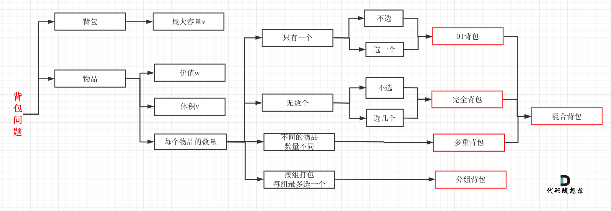

# 教程

[https://programmercarl.com/背包理论基础01背包-1.html](https://programmercarl.com/背包理论基础01背包-1.html#_01-背包)




背包问题有多种背包方式，常见的有：01背包、完全背包、多重背包、分组背包和混合背包等等

一个商品如果可以重复多次放入是完全背包，而只能放入一次是01背包

# 0/1 Knapsack, 0/1 背包

## 416. 分割等和子集 - 转化后为0-1背包可行性问题
https://leetcode-cn.com/problems/partition-equal-subset-sum/

```python
class Solution:
    def canPartition(self, nums: List[int]) -> bool:
        if not nums: return True
        sum_ = sum(nums)
        if sum_ % 2 != 0: return False
        target = int(sum_ / 2)

        if target in nums: return True
        if target < max(nums): return False

        """
        BFS: 该方法存在超时, 把stack改成set类型就解决了
        """
        stack = set([nums[0]]) # 记录处理过程中的 和值
        for i in range(1, len(nums)):
            # 不像普通回溯，stack中作为不把p放入的值，保留不pop
            add = [k+nums[i] for k in stack]
            stack.update(add)
            if target in stack:
                return True
        return False

        """
        转换为 背包问题
        dp[i][j] ：对于前 i 个物品，当前背包的容量为 j 时，可以恰好将背包装满则为True
        """
        n = len(nums)
        dptable = [[False] * (target + 1) for _ in range(n)]

        # 当target=0时，所有都不装进包里就行
        dptable[:][0] = [True] * n
        dptable[0][nums[0]] = True
        for i in range(1, n):
            for t in range(1, target+1):
                # 包不够大，装不下
                if nums[i] > t:
                    dptable[i][t] = dptable[i-1][t]
                else:
                    # 不装能行吗？装进入又能行吗？
                    dptable[i][t] = dptable[i-1][t] | dptable[i-1][t-nums[i]]

        return dptable[-1][-1]

        """
        注意到状态仅仅与 i-1行相关，可做状态压缩
        """
        dptable = [True] + [False] * target
        dptable[nums[0]] = True
        for i in range(1, len(nums)):
            for j in range(target, 0, -1):  # 注意：这里要逆向遍历，每一个元素一定是不可重复放入，所以从大到小遍历
                if nums[i] <= j:
                    dptable[j] = dptable[j] | dptable[j-nums[i]]
        return dptable[target]  
```

## 1049. 最后一块石头的重量 II - 转化后为0-1背包最小值问题
https://leetcode-cn.com/problems/last-stone-weight-ii/

```python
class Solution:
    def lastStoneWeightII(self, stones: List[int]) -> int:
        """
        思路：装成两个包，使其和相差最小
        dp[i][j]:前i个物品，在不超过j的情况下，最多装多少
        """
        sumweight = sum(stones)
        target = sumweight // 2

        dp = [[0]*(target+1) for _ in range(len(stones))]
        for j in range(stones[0], target+1):
            dp[0][j] = stones[0]
            
        for i in range(1, len(stones)):
            for j in range(1, target+1):
                if stones[i] > j:
                    dp[i][j] = dp[i-1][j]
                else:
                    dp[i][j] = max(dp[i-1][j], dp[i-1][j - stones[i]] + stones[i])

        return sumweight -  2 * dp[-1][target]
```

和416一样，可以作状态压缩
```python
class Solution:
    def lastStoneWeightII(self, stones: List[int]) -> int:
        sumweight = sum(stones)
        target = sumweight // 2
        dp = [0] * 15001
        for i in range(len(stones)):
            for j in range(target, stones[i] - 1, -1):
                dp[j] = max(dp[j], dp[j - stones[i]] + stones[i])
        return sumweight -  2 * dp[target]
```


## 494. 目标和 - 0-1背包方案数问题
https://leetcode-cn.com/problems/target-sum/

```python
class Solution:
    count = 0
    def findTargetSumWays(self, nums: List[int], target: int) -> int:
        """
        思路：bagA-bagB=target & bagA+bagB=sum，则求能装bagB的方案数即可
        dp[i][j]: 前i个物品，能恰好装满bagB的方案数
        """
        sum_ = sum(nums)
        diff = sum_ - target
        if diff < 0 or diff%2 !=0: return 0

        neg = int(diff / 2)
        dp = [[0] * (neg+1) for _ in range(len(nums)+1)]
        dp[0][0] = 1
        for i in range(1,len(nums)+1):
            for j in range(neg+1):
                dp[i][j] = dp[i-1][j]
                if j>=nums[i-1]:
                    dp[i][j] += dp[i-1][j-nums[i-1]]
        return dp[-1][-1]
        
        """
        和416一样，可以做状态压缩
        """
        dp = [0] * (neg+1)
        dp[0] = 1
        for n in nums:
            for j in range(neg, n-1, -1):
                dp[j] += dp[j-n]
        return dp[-1]
```


-   多维背包
    -   [ ] [474. 一和零](https://leetcode-cn.com/problems/ones-and-zeroes/)                                                                         多维费用的 0-1 背包最大值
    -   [ ] [879. 盈利计划](https://leetcode-cn.com/problems/profitable-schemes/)                                                                      多维费用的 0-1 背包最大值


    
[1770. 执行乘法运算的最大分数](https://leetcode-cn.com/problems/maximum-score-from-performing-multiplication-operations/)

[956. 最高的广告牌](https://leetcode-cn.com/problems/tallest-billboard/)

[1751. 最多可以参加的会议数目 II](https://leetcode-cn.com/problems/maximum-number-of-events-that-can-be-attended-ii/)


# Unbounded Knapsack，无限（完全）背包

## 322. 零钱兑换 - 完全背包最小值
https://leetcode-cn.com/problems/coin-change/


## 279. 完全平方数 - 322相似题
https://leetcode-cn.com/problems/perfect-squares/


## 518. 零钱兑换 II - 完全背包方案数
https://leetcode-cn.com/problems/coin-change-2/


## 377. 组合总和 Ⅳ - 70相似题
https://leetcode-cn.com/problems/combination-sum-iv/

考虑物品顺序的完全背包方案数。每个物品可以重复拿，有几种装满背包方案？


[638. 大礼包](https://leetcode-cn.com/problems/shopping-offers/)

[1449. 数位成本和为目标值的最大数字](https://leetcode-cn.com/problems/form-largest-integer-with-digits-that-add-up-to-target/)

-   分组背包
    -   [ ] [1155. 掷骰子的N种方法](https://leetcode-cn.com/problems/number-of-dice-rolls-with-target-sum/)   每一组是一个骰子，每个骰子只能拿一个体积为1到6的物品
