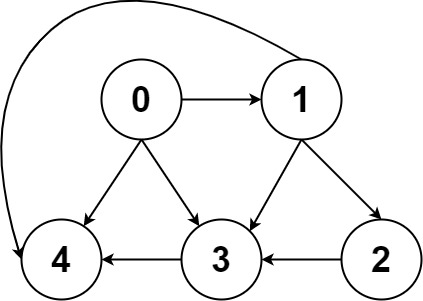
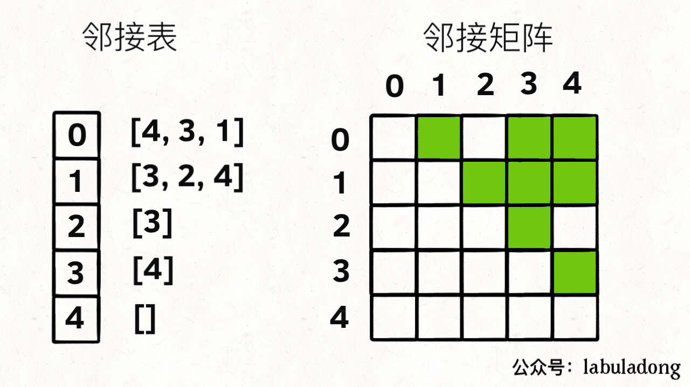

<https://labuladong.gitee.io/algo/2/19/>

图的实现：**邻接表** 和 **邻接矩阵**





-   邻接表
    占用的空间少
-   邻接矩阵
    快速判断两个节点是否相邻

### 遍历

图和多叉树最大的区别是，图是可能包含环的，你从图的某一个节点开始遍历，有可能走了一圈又回到这个节点。

所以，如果图包含环，遍历框架就要一个 `visited` 数组进行辅助

#### [797. 所有可能的路径](https://leetcode-cn.com/problems/all-paths-from-source-to-target/ "797. 所有可能的路径")

题目已经说明是有向无环图了，所以可以 省去  `visited` 数组。

```python
class Solution:
    def allPathsSourceTarget(self, graph: List[List[int]]) -> List[List[int]]:
        '''
        有向无环图的遍历
        '''
        res = []
        target = len(graph)
        def get_path(start, path):
            if start == target-1:
                res.append(path + [start])
                return
            
            for v in graph[start]:
                path.append(start) # 选择
                get_path(v, path)
                path.pop(-1) # 撤销选择
    
        get_path(0, [])
        return res
```

### 环检测

#### [207. 课程表](https://leetcode-cn.com/problems/course-schedule/ "207. 课程表")

什么时候无法修完所有课程？当存在循环依赖的时候。

**看到依赖问题，首先想到的就是把问题转化成「有向图」这种数据结构，只要图中存在环，那就说明存在循环依赖**。

-   深度优先遍历
    ```python
    class Solution:
        def canFinish(self, numCourses: int, prerequisites: List[List[int]]) -> bool:
            edges = collections.defaultdict(list)
            visited = [0] * numCourses
            result = list()
            valid = True

            # 建立邻接表
            for info in prerequisites:
                edges[info[1]].append(info[0])
            
            def dfs(u: int):
                # nonlocal声明的变量不是局部变量,也不是全局变量,而是外部嵌套函数内的变量。
                nonlocal valid 
                visited[u] = 1
                for v in edges[u]:
                    if visited[v] == 0:
                        dfs(v)
                        if valid == False:
                            return
                    elif visited[v] == 1:
                        valid = False  # 访问到环了
                        return
                visited[u] = 2
                result.append(u)
            
            # 遍历所有节点
            for i in range(numCourses):
                if valid and not visited[i]:
                    dfs(i)
            
            return valid
    ```
    时间复杂度: $O(n+m)$，其中 n 为课程数，m 为先修课程的要求数。这其实就是对图进行深度优先搜索的时间复杂度。

    空间复杂度: $O(n+m)$。题目中是以列表形式给出的先修课程关系，为了对图进行深度优先搜索，我们需要存储成邻接表的形式，空间复杂度为 $O(n+m)$。在深度优先搜索的过程中，我们需要最多 O(n) 的栈空间（递归）进行深度优先搜索，因此总空间复杂度为 $O(n+m)$。
-   广度优先遍历

    深度优先搜索是一种「逆向思维」：最先被放入栈中的节点是在拓扑排序中最后面的节点。我们也可以使用正向思维，顺序地生成拓扑排序，这种方法也更加直观。

    我们考虑拓扑排序中最前面的节点，该节点一定不会有任何入边，也就是它没有任何的先修课程要求。当我们将一个节点加入答案中后，我们就可以移除它的所有出边，代表着它的相邻节点少了一门先修课程的要求。**如果某个相邻节点变成了「没有任何入边的节点」，那么就代表着这门课可以开始学习了**。按照这样的流程，我们不断地将没有入边的节点加入答案，直到答案中包含所有的节点（得到了一种拓扑排序）或者不存在没有入边的节点（图中包含环）。

    上面的想法类似于广度优先搜索，因此我们可以将广度优先搜索的流程与拓扑排序的求解联系起来。
    ```python
    class Solution:
        def canFinish(self, numCourses: int, prerequisites: List[List[int]]) -> bool:
            edges = collections.defaultdict(list)
            indeg = [0] * numCourses

            for info in prerequisites:
                edges[info[1]].append(info[0])
                indeg[info[0]] += 1   # 修该课时，需要选修几门课（入度）
            
            # 从不需要必修课的课程开始（入度为0）
            q = collections.deque([u for u in range(numCourses) if indeg[u] == 0])
            visited = 0

            while q:
                visited += 1
                u = q.popleft()
                for v in edges[u]:
                    indeg[v] -= 1
                    if indeg[v] == 0:
                        q.append(v)

            return visited == numCourses
    ```
    时间复杂度: O(n+m)，其中 n为课程数，m为先修课程的要求数。这其实就是对图进行广度优先搜索的时间复杂度。

    空间复杂度: O(n+m)。题目中是以列表形式给出的先修课程关系，为了对图进行广度优先搜索，我们需要存储成邻接表的形式，空间复杂度为 O(n+m)。在广度优先搜索的过程中，我们需要最多 O(n) 的队列空间（迭代）进行广度优先搜索。因此总空间复杂度为 O(n+m)。

### 拓扑排序（Topological Sorting）

#### [210. 课程表 II](https://leetcode-cn.com/problems/course-schedule-ii/ "210. 课程表 II")

题目描述：上题只需要判断能不能，本题需要输出 学习路径

-   深度优先遍历
    ```python
    class Solution:
        def findOrder(self, numCourses: int, prerequisites: List[List[int]]) -> List[int]:
            # 存储有向图
            edges = collections.defaultdict(list)
            # 标记每个节点的状态：0=未搜索，1=搜索中，2=已完成
            visited = [0] * numCourses
            # 用数组来模拟栈，下标 0 为栈底，n-1 为栈顶
            result = list()
            # 判断有向图中是否有环
            valid = True

            for info in prerequisites:
                edges[info[1]].append(info[0])
            
            def dfs(u: int):
                nonlocal valid
                # 将节点标记为「搜索中」
                visited[u] = 1
                
                for v in edges[u]:
                    if visited[v] == 0:
                        dfs(v)
                        if not valid: # 发现有环，立即停止搜索
                            return
                    elif visited[v] == 1:  # 找到环了
                        valid = False
                        return
                # 将节点标记为「已完成」
                visited[u] = 2
                # 将节点入栈
                result.append(u)    # 和上题相比的关键点，保存访问路径
            
            # 每次挑选一个「未搜索」的节点，开始进行深度优先搜索
            for i in range(numCourses):
                if valid and not visited[i]:
                    dfs(i)
            
            if not valid:
                return list()
            
            # 如果没有环，那么就有拓扑排序
            # 注意下标 0 为栈底，因此需要将数组反序输出
            return result[::-1]

    ```
-   广度优先遍历
    ```python
    class Solution:
        def findOrder(self, numCourses: int, prerequisites: List[List[int]]) -> List[int]:
            # 存储有向图
            edges = collections.defaultdict(list)
            # 存储每个节点的入度
            indeg = [0] * numCourses
            # 存储答案
            result = list()

            for info in prerequisites:
                edges[info[1]].append(info[0])
                indeg[info[0]] += 1
            
            # 将所有入度为 0 的节点放入队列中
            q = collections.deque([u for u in range(numCourses) if indeg[u] == 0])

            while q:
                u = q.popleft()
                result.append(u)  # 和上题相比的关键点，保存访问路径
                for v in edges[u]:
                    indeg[v] -= 1
                    # 如果相邻节点 v 的入度为 0，就可以选 v 对应的课程了
                    if indeg[v] == 0:
                        q.append(v)

            if len(result) != numCourses:
                result = list()
            return result

    ```

### 二分图判定

> 二分图的顶点集可分割为两个互不相交的子集，图中每条边依附的两个顶点都分属于这两个子集，且两个子集内的顶点不相邻。

> 📌**给你一幅「图」，请你用两种颜色将图中的所有顶点着色，且使得任意一条边的两个端点的颜色都不相同，你能做到吗**？
>
> 这就是图的「双色问题」，其实这个问题就等同于二分图的判定问题，如果你能够成功地将图染色，那么这幅图就是一幅二分图，反之则不是。

#### [785. 判断二分图（中等）](https://leetcode-cn.com/problems/is-graph-bipartite "785. 判断二分图（中等）")

[886. 可能的二分法（中等）](https://leetcode-cn.com/problems/possible-bipartition "886. 可能的二分法（中等）")

### 并查集算法计算连通分量

#### [323. 无向图中的连通分量数目](https://leetcode-cn.com/problems/number-of-connected-components-in-an-undirected-graph/ "323. 无向图中的连通分量数目")

#### [130. 被围绕的区域](https://leetcode-cn.com/problems/surrounded-regions/ "130. 被围绕的区域")

#### [990. 等式方程的可满足性](https://leetcode-cn.com/problems/satisfiability-of-equality-equations/ "990. 等式方程的可满足性")

### 最小生成树（Minimum Spanning Tree）

最小生成树算法主要有 Prim 算法（普里姆算法）和 Kruskal 算法（克鲁斯卡尔算法）两种，这两种算法虽然都运用了贪心思想，但从实现上来说差异还是蛮大的。
**Kruskal 算法其实很容易理解和记忆，其关键是要熟悉并查集算法。**

#### [261. 以图判树](https://leetcode-cn.com/problems/graph-valid-tree/ "261. 以图判树")

#### [1135. 最低成本联通所有城市](https://leetcode-cn.com/problems/connecting-cities-with-minimum-cost/ "1135. 最低成本联通所有城市")

#### [1584. 连接所有点的最小费用](https://leetcode-cn.com/problems/min-cost-to-connect-all-points/ "1584. 连接所有点的最小费用")

***

下面是Prim 算法的练手题

#### [1135. 最低成本联通所有城市](https://leetcode-cn.com/problems/connecting-cities-with-minimum-cost/ "1135. 最低成本联通所有城市")

#### [1584. 连接所有点的最小费用](https://leetcode-cn.com/problems/min-cost-to-connect-all-points/ "1584. 连接所有点的最小费用")

### 名流问题

#### [277. 搜索名人](https://leetcode-cn.com/problems/find-the-celebrity/ "277. 搜索名人")

### Dijkstra最短路径算法

#### [743. 网络延迟时间](https://leetcode-cn.com/problems/network-delay-time "743. 网络延迟时间")

#### [1514. 概率最大的路径](https://leetcode-cn.com/problems/path-with-maximum-probability "1514. 概率最大的路径")

#### [1631. 最小体力消耗路径](https://leetcode-cn.com/problems/path-with-minimum-effort "1631. 最小体力消耗路径")
