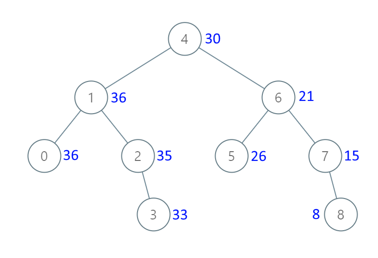

二叉搜索树（Binary Search Tree，简写 BST）

<https://labuladong.gitbook.io/algo/mu-lu-ye-1/mu-lu-ye-1/bst1>

<https://labuladong.gitbook.io/algo/mu-lu-ye-1/mu-lu-ye-1/er-cha-sou-suo-shu-cao-zuo-ji-jin>

<https://labuladong.gitbook.io/algo/mu-lu-ye-1/mu-lu-ye-1/bst3>

<https://programmercarl.com/0700.二叉搜索树中的搜索.html#递归法>

# 搜索

## 700. 二叉搜索树中的搜索（简单）
https://leetcode-cn.com/problems/search-in-a-binary-search-tree

题目描述：给定二叉搜索树（BST）的根节点和一个值。 你需要在BST中找到节点值等于给定值的节点。 返回以该节点为根的子树。 如果节点不存在，则返回 NULL。

```python
class Solution:
    def searchBST(self, root: TreeNode, val: int) -> TreeNode:
        # 递归 时间复杂度O(n), 空间复杂度O(n)
        if not root: return None

        if root.val == val:
            return root
        elif root.val < val:
            return self.searchBST(root.right, val)
        else:
            return self.searchBST(root.left, val)
            
        # 迭代 时间复杂度O(n), 空间复杂度O(1)
        while root:
            if val == root.val:
                return root
            root = root.left if val < root.val else root.right
        return None

```

## 98. 验证二叉搜索树（中等）
https://leetcode-cn.com/problems/validate-binary-search-tree

```python
class Solution:
    def isValidBST(self, root: TreeNode) -> bool:
        # 递归 时间复杂度O(n), 空间复杂度O(n)
        def helper(node, lower = float('-inf'), upper = float('inf')) -> bool:
            if not node: return True
            
            val = node.val
            if val <= lower or val >= upper:
                return False

            return helper(node.right, val, upper) and helper(node.left, lower, val)

        return helper(root)
        
        # 中序遍历 时间复杂度O(n), 空间复杂度O(n)
        stack, inorder = [], float('-inf')
        
        while stack or root:
            while root:
                stack.append(root)
                root = root.left
            root = stack.pop()
            if root.val <= inorder:
                return False
            inorder = root.val
            root = root.right

        return True
        
        # 用统一迭代的框架写中序遍历，只要在打印节点值时加个判断就可以了。
        stack = [root]
        tmpval = float('-inf')

        while stack:
            cur = stack.pop()
            if cur:
                if cur.right: stack.append(cur.right)

                stack.append(cur)
                stack.append(None)

                if cur.left: stack.append(cur.left)
            else:
                cur = stack.pop()
                if cur.val <= tmpval:
                    return False
                tmpval = cur.val

        return True

```

## 530. 二叉搜索树的最小绝对差
https://leetcode-cn.com/problems/minimum-absolute-difference-in-bst/

题目描述：给你一个二叉搜索树的根节点 `root` ，返回 **树中任意两不同节点值之间的最小差值** 。差值是一个正数，其数值等于两值之差的绝对值。

题解：采用中序遍历，得到的数值有序，比较每一对差值即可。

```python
class Solution:
    def getMinimumDifference(self, root: TreeNode) -> int:
        if not root: return -1
        stack = [root]
        pre = -1  # 记录前面的数值
        min_ = float('inf')  # 记录最小值
        while stack:
            cur = stack.pop()
            if cur:
                if cur.right: stack.append(cur.right)
                stack.append(cur)
                stack.append(None)
                if cur.left: stack.append(cur.left)
            else:
                cur = stack.pop()
                if pre!=-1:
                    min_ = min(min_, cur.val-pre)
                pre = cur.val
                
        return min_
```

## 501. 二叉搜索树中的众数
https://leetcode-cn.com/problems/find-mode-in-binary-search-tree/

和之前的题一样，也是中序遍历，在打印节点值的时候需要做计数。

-   统一迭代的方式进行中序遍历
    ```python
    class Solution:
        def findMode(self, root: TreeNode) -> List[int]:
            if not root: return []
            stack = [root]

            nums = []
            pre = None # 记录遍历时前者节点的值
            count = 0
            maxcount = 0
            while stack:
                cur = stack.pop()
                if cur:
                    if cur.right: stack.append(cur.right)
                    stack.append(cur)
                    stack.append(None)
                    if cur.left: stack.append(cur.left)
                else:
                    cur = stack.pop()
                    if pre == None:
                        count = 1
                    elif cur.val == pre:
                        count += 1
                    else:
                        count = 1
                    
                    if count == maxcount:
                        nums.append(cur.val)
                    if count > maxcount:
                        maxcount = count
                        nums.clear()
                        nums.append(cur.val)

                    pre = cur.val
                    
            return nums
    ```
-   递归的话怎么写？为了代码逻辑清晰，把递归遍历的部分取出封装成新函数。
    ```python
    class Solution:
        def __init__(self):
            self.pre = TreeNode()
            self.count = 0
            self.max_count = 0
            self.result = []

        def findMode(self, root: TreeNode) -> List[int]:
            if not root: return None
            self.search_BST(root)
            return self.result
            
        def search_BST(self, cur: TreeNode) -> None:
            if not cur: return None
            self.search_BST(cur.left)
            # 第一个节点
            if not self.pre:
                self.count = 1
            # 与前一个节点数值相同
            elif self.pre.val == cur.val:
                self.count += 1 
            # 与前一个节点数值不相同
            else:
                self.count = 1
            self.pre = cur

            if self.count == self.max_count:
                self.result.append(cur.val)
            
            if self.count > self.max_count:
                self.max_count = self.count
                self.result = [cur.val]  # 清空self.result，确保result之前的的元素都失效
            
            self.search_BST(cur.right)
    ```

## 230. BST第K小的元素（中等）
https://leetcode-cn.com/problems/kth-smallest-element-in-a-bst

这题简单的做法就是 中序遍历+计数，就可以得到结果。
官方给出的解答比较有意思，给出了其他的方法，保存各个子树的节点树 和 考虑平衡二叉搜索树（AVL树）的频繁修改情况。

# 公共祖先

## 236. 二叉树的最近公共祖先
https://leetcode-cn.com/problems/lowest-common-ancestor-of-a-binary-tree/

```python
class Solution:
    def lowestCommonAncestor(self, root: 'TreeNode', p: 'TreeNode', q: 'TreeNode') -> 'TreeNode':
        if not root:
            return None
        
        if root.val in [p.val, q.val]:
            return root
        
        left = self.lowestCommonAncestor(root.left, p, q)
        right = self.lowestCommonAncestor(root.right, p, q)

        if left and right:  # 两个节点在两边
            return root
        elif left:  # 右边无pq，都在左边，左边访问的时候，会先访问到更高的点，即为两者的最近公共祖先
            return left
        else:       # 左边无pq，理论同上
            return right
```

## 235. 二叉搜索树的最近公共祖先
https://leetcode-cn.com/problems/lowest-common-ancestor-of-a-binary-search-tree/

题解：如果节点的数值在目标区间就是最近公共祖先

```python
class Solution:
    def lowestCommonAncestor(self, root: TreeNode, p: TreeNode, q: TreeNode) -> TreeNode:
        ancestor = root
        while True:
            if p.val < ancestor.val and q.val < ancestor.val:
                ancestor = ancestor.left
            elif p.val > ancestor.val and q.val > ancestor.val:
                ancestor = ancestor.right
            else:
                break
        return ancestor
```

# 剪枝

## 450. 删除二叉搜索树中的节点（中等）
https://leetcode-cn.com/problems/delete-node-in-a-bst

题解：删除之后需要调整二叉树。

```python
class Solution:
    def deleteNode(self, root: TreeNode, key: int) -> TreeNode:
        """
        思路：
        找到待删节点的右子树上的最小值作为代替值
        """
        if not root: return None
        if root.val == key:
            if not root.left: return root.right
            if not root.right: return root.left
            cur = root.right  # 右子树中的最左节点
            while cur.left:
                cur = cur.left
            root.val = cur.val
            root.right = self.deleteNode(root.right, cur.val)
        elif root.val < key:
            root.right = self.deleteNode(root.right, key)
        else:
            root.left = self.deleteNode(root.left, key)
        
        return root
```

## 669. 修剪二叉搜索树
https://leetcode-cn.com/problems/trim-a-binary-search-tree/

题目描述：给你二叉搜索树的根节点 root ，同时给定最小边界`low` 和最大边界 `high`。通过修剪二叉搜索树，使得所有节点的值在`[low, high]`中。修剪树不应该改变保留在树中的元素的相对结构（即，如果没有被移除，原有的父代子代关系都应当保留）。 可以证明，存在唯一的答案。
所以结果应当返回修剪好的二叉搜索树的新的根节点。注意，根节点可能会根据给定的边界发生改变。

```python
class Solution:
    def trimBST(self, root: Optional[TreeNode], low: int, high: int) -> Optional[TreeNode]:
        if not root: return None
        if root.val < low: 
            return self.trimBST(root.right, low, high)
        elif root.val > high: 
            return self.trimBST(root.left, low, high)
        else:
            root.left = self.trimBST(root.left, low, high)
            root.right = self.trimBST(root.right, low, high)
            return root
```

# 构造

## 701. 二叉搜索树中的插入操作（中等）
https://leetcode-cn.com/problems/insert-into-a-binary-search-tree

> 📌写递归的时候，要考虑的是base情况，在二叉树中尤为常见。所有子树也都是二叉树，所以可以考虑最小单元的二叉树。

```python
class Solution:
    def insertIntoBST(self, root: TreeNode, val: int) -> TreeNode:
        if not root: return TreeNode(val=val, left=None, right=None)
        
        if root.val < val:
            root.right = self.insertIntoBST(root.right, val)
        else:
            root.left = self.insertIntoBST(root.left, val)

        return root
```

## 538. 二叉搜索树转化累加树（中等）
https://leetcode-cn.com/problems/convert-bst-to-greater-tree

题目描述：



```python
class Solution:
    def convertBST(self, root: TreeNode) -> TreeNode:
        # 改成右中左的遍历方式
        tmpsum = 0
         
        stack = []
        cur = root
        while cur or stack:
            if cur:
                stack.append(cur)
                cur = cur.right
            else: 
                cur = stack.pop(-1)
                tmpsum += cur.val
                cur.val = tmpsum
                cur = cur.left

        return root
```

## 108. 将有序数组转换为二叉搜索树
https://leetcode-cn.com/problems/convert-sorted-array-to-binary-search-tree/

题目描述：给你一个整数数组 `nums` ，其中元素已经按 **升序** 排列，请你将其转换为一棵 **高度平衡** 二叉搜索树。

题解：选择中间位置的值作为根节点。

```python
class Solution:
    def sortedArrayToBST(self, nums: List[int]) -> TreeNode:
        if not nums: return None
        
        ind = int(len(nums)/2)
        root = TreeNode(val=nums[ind])

        root.left = self.sortedArrayToBST(nums[:ind])
        root.right = self.sortedArrayToBST(nums[ind+1:])

        return root
```

## 96. 不同的二叉搜索树
https://leetcode-cn.com/problems/unique-binary-search-trees

题目描述：给你一个整数 `n` ，求恰由 `n` 个节点组成且节点值从 `1` 到 `n` 互不相同的 **二叉搜索树** 有多少种？返回满足题意的二叉搜索树的种数。

题解：动态规划

-   备忘录
    ```python
    class Solution:
        def numTrees(self, n: int) -> int:
            """
            举例：n = 5，假设root节点选3，则左子树{1，2}排，右子树{4，5}排
            """
            memo = {}
            def compute(start, end):
                if start >= end: return 1

                key = "{}-{}".format(start, end)
                if key in memo:
                    return memo[key]

                sum = 0
                for i in range(start, end+1):
                    tkey = "{}-{}".format(start, i-1)
                    if tkey in memo:
                        left = memo[tkey]
                    else:
                        left = compute(start, i-1)

                    tkey = "{}-{}".format(i+1, end)
                    if tkey in memo:
                        right = memo[tkey]
                    else:
                        right = compute(i+1, end)
                    sum += left * right
                
                memo[key] = sum
                return sum
            
            return compute(1, n)

    ```
-   dptable
    ```python
    class Solution:
        def numTrees(self, n):
            # G(x): 记录x长度的有序数组，满足条件的种树
            G = [0]*(n+1)
            G[0], G[1] = 1, 1

            for i in range(2, n+1):
                for j in range(1, i+1):
                    G[i] += G[j-1] * G[i-j]

            return G[n]

    ```
    -   时间复杂度 : O(n^2)，其中 n 表示二叉搜索树的节点个数。G(n) 函数一共有 n 个值需要求解，每次求解需要 O(n) 的时间复杂度，因此总时间复杂度为 O(n^2)。
    -   空间复杂度 : O(n)。我们需要 O(n) 的空间存储 G数组。

## 95. 不同的二叉搜索树II
https://leetcode-cn.com/problems/unique-binary-search-trees-ii

题目描述：给你一个整数 `n` ，请你生成并返回所有由 `n` 个节点组成且节点值从 `1` 到 `n` 互不相同的不同 **二叉搜索树** 。可以按 **任意顺序** 返回答案。

题解：回溯

```python
class Solution:
    def generateTrees(self, n: int) -> List[TreeNode]:
        
        def compute(start, end):
            res = []

            if start>end: return [None]

            if start==end: return [TreeNode(val=start)]
            
            # 轮流为头节点
            for i in range(start, end+1):
                left = compute(start, i-1)
                right = compute(i+1, end)
                for l in left:
                    for r in right:
                        res.append(TreeNode(val=i, left=l, right=r))
            return res
                
        return compute(1, n)
```
