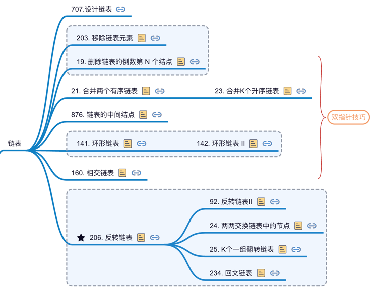

# 删除结点

## 203. 移除链表元素

https://leetcode-cn.com/problems/remove-linked-list-elements/

```python
class Solution:
    def removeElements(self, head: ListNode, val: int) -> ListNode:
        dummy = ListNode(next=head) # 伪头结点
        
        p = dummy
        while p.next:
            if p.next.val == val:
                p.next = p.next.next
            else:
                p = p.next

        return dummy.next
```

## 19.删除链表的倒数第N个节点

https://leetcode-cn.com/problems/remove-nth-node-from-end-of-list/

```python
class Solution:
    def removeNthFromEnd(self, head: ListNode, n: int) -> ListNode:
        """
        思路：保持左右指针相差N
        让right先走N步，再同时走，right到终点的时候，left就该在倒数N的结点
        """
        dummy = ListNode(next=head) # 伪头节点

        left, right = dummy, dummy
        for _ in range(n): right = right.next

        while right.next:
            left = left.next
            right = right.next

        left.next = left.next.next

        return dummy.next
```

# 合并链表

##  21. 合并两个有序链表

https://leetcode.cn/problems/merge-two-sorted-lists/description/)

```python
class Solution:
    def mergeTwoLists(self, list1: Optional[ListNode], list2: Optional[ListNode]) -> Optional[ListNode]:
        dummy = ListNode()
        cur = dummy
    
        p, q = list1, list2
        while p and q:
            if p.val <= q.val:
                cur.next = p
                p = p.next
            else: 
                cur.next = q
                q = q.next
            cur = cur.next
        
        if p: cur.next = p
        if q: cur.next = q
        
        return dummy.next
```


## 23. 合并 K 个升序链表

https://leetcode.cn/problems/merge-k-sorted-lists/description/

难点在于，如何快速得到 k 个节点中的最小节点，接到结果链表上？

这里就要用到 优先级队列（二叉堆） 这种数据结构，把链表节点放入一个最小堆，就可以每次获得 k 个节点中的最小节点


# 876.链表的中间结点

https://leetcode-cn.com/problems/middle-of-the-linked-list/

利用快慢指针，左指针一次走一步，右指针一次走两步

```python
class Solution:
    def middleNode(self, head: ListNode) -> ListNode:
        left, right = head, head

        while right and right.next:
            left = left.next
            right = right.next.next
        
        return left
```


# 环形链表

## 141.环形链表

https://leetcode-cn.com/problems/linked-list-cycle/

```python
class Solution:
    def hasCycle(self, head: ListNode) -> bool:
        slow, fast = head, head
        while fast!=None and fast.next!=None:
            slow = slow.next
            fast = fast.next.next
            if slow == fast:
                return True

        return False
```

## 142.环形链表 II

https://leetcode-cn.com/problems/linked-list-cycle-ii/

```python
class Solution:
    def detectCycle(self, head: ListNode) -> ListNode:
        slow, fast = head, head
        while fast!=None and fast.next!=None:
            slow = slow.next
            fast = fast.next.next
            if slow == fast: break

        if fast is None or fast.next is None: return None

        slow = head
        while slow!=fast:
            slow = slow.next
            fast = fast.next

        return slow
```


# 160. 相交链表

https://leetcode-cn.com/problems/intersection-of-two-linked-lists/

https://labuladong.gitee.io/algo/2/17/16/

解法一：
两条链表连起来，A访问完，访问B；终会相遇。
```python
class Solution:
    def getIntersectionNode(self, headA: ListNode, headB: ListNode) -> ListNode:
        p, q = headA, headB
        while p!=q:
            if p:
                p = p.next
            else:
                p = headB
            
            if q:
                q = q.next
            else:
                q = headA

        return p
```

解法二：
将尾节点和某链表的头结点相连，转换成环形链表找交点的问题。

解法三：
计算A和B的链表长度，让长的先走相差的步数，然后再一对一的走。


# 反转链表

## 206. 反转链表
https://leetcode.cn/problems/reverse-linked-list/

-   递归
    ```python
    class Solution:
        def reverseList(self, head: Optional[ListNode]) -> Optional[ListNode]:
            if not head or not head.next: return head 
            newhead = self.reverseList(head.next)
            head.next.next = head
            head.next = None
            return newhead
    ```
-   迭代

    起一个空链表，然后将一个个节点插入
    ```python
    class Solution:
        def reverseList(self, head: Optional[ListNode]) -> Optional[ListNode]:
            prev, cur = None, head
            # cur是待插入的节点，prev一直是新链表的头节点
            while cur:
                tmp = cur.next
                cur.next = prev
                prev = cur
                cur = tmp
            return prev
    ```

## 92. 反转链表 II
https://leetcode.cn/problems/reverse-linked-list-ii/

根据位置参数，只反转链表的一部分

```python
class Solution:
    def reverseBetween(self, head: ListNode, left: int, right: int) -> ListNode:

        # 加伪节点，避免分情况讨论（left是否为1）
        fakeh = ListNode(val=-1, next=head)
        S = fakeh  # left 位置的前一个节点
          
        for _ in range(left-1):
            S = S.next
            
        cur = S.next  # left位置的节点
        for _ in range(right-left):
            tmp = cur.next # 从待反转的第二个节点开始处理
            
            # 插入tmp, S和cur都没动
            cur.next = tmp.next
            tmp.next = S.next
            S.next = tmp

        return fakeh.next
```

## 24. 两两交换链表中的节点

https://leetcode-cn.com/problems/swap-nodes-in-pairs/

```python
class Solution:
    def swapPairs(self, head: ListNode) -> ListNode:
        dummy = ListNode(next=head)
        pre = dummy
        
        # 必须有pre的下一个和下下个才能交换，否则说明已经交换结束了
        while pre.next and pre.next.next:
            cur = pre.next
            post = pre.next.next
            
            # pre，cur，post对应最左，中间的，最右边的节点
            cur.next = post.next
            post.next = cur
            pre.next = post

            pre = pre.next.next
        return dummy.next
```

## 25. K个一组翻转链表

https://leetcode-cn.com/problems/reverse-nodes-in-k-group/

```python
class Solution:
    def reverseKGroup(self, head: ListNode, k: int) -> ListNode:
        a = head
        b = head
        for i in range(k):
            if b is None: return head
            b = b.next

        newh = self._reverse_block(a, b)
        a.next = self.reverseKGroup(b, k)
        return newh

    # 反转以head为头节点的链表
    def _reverse(self, head: ListNode):
        pre = None
        cur = head

        while cur!=None:
            tmp = cur.next
            cur.next = pre
            pre = cur
            cur = tmp

        return pre

    # 反转区间 [a, b) 的元素，注意是左闭右开
    def _reverse_block(self, a: ListNode, b: ListNode):
        pre = None
        cur = a

        while cur!=b:
            tmp = cur.next
            cur.next = pre
            pre = cur
            cur = tmp

        return pre
```

## 234.回文链表

https://leetcode-cn.com/problems/palindrome-linked-list/

解法一：找到中间结点，将后半段链表翻转，然后开始对比
```python
class Solution:
    def isPalindrome(self, head: ListNode) -> bool:
        # 利用快慢指针找到 中点位置
        slow, fast = head, head
        while fast and fast.next:
            slow = slow.next
            fast = fast.next.next
        
        if fast is not None:  # 链表长度为偶数
            slow = slow.next

        right = self._reverse(slow)
        left = head
        while right!=None:
            if right.val!= left.val: return False
            right = right.next
            left = left.next

        return True

    def _reverse(self, head: ListNode):
        pre = None
        cur = head
        while cur!=None:
            tmp = cur.next
            cur.next = pre
            pre = cur
            cur = tmp

        return pre
```

解法二：利用栈，找中间节点的过程中保存左边结点，再进行对比
```python
class Solution:
    def isPalindrome(self, head: ListNode) -> bool:
        stack = []

        left, right = head, head
        while right and right.next:
            stack.append(left)
            left = left.next
            right = right.next.next

        if right: left = left.next  # 链表长度为奇数
        # left和栈一起走
        while stack:
            node = stack.pop(-1)
            if not left or node.val!=left.val:
                return False
            left = left.next

        return True
```


