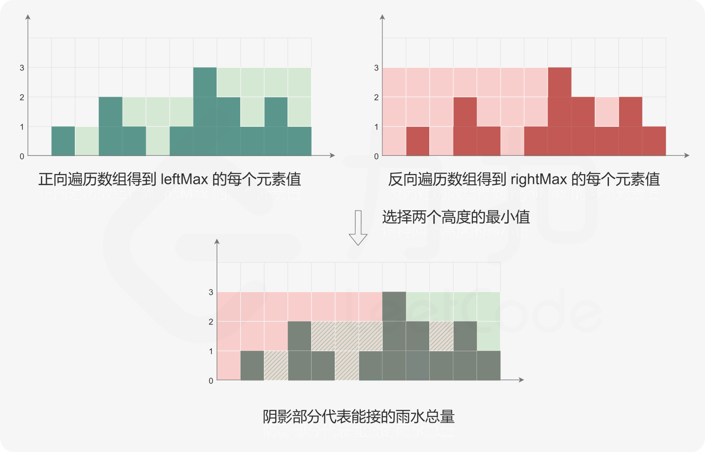

# 什么时候用单调栈呢？

**通常是一维数组，要寻找任一个元素的右边或者左边第一个比自己大或者小的元素的位置，此时我们就要想到可以用单调栈了**。

时间复杂度为$O(n)$

## 739. 每日温度
https://leetcode-cn.com/problems/daily-temperatures/

题目描述：要想观测到更高的气温，至少需要等待的天数。如果气温在这之后都不会升高，请在该位置用 0 来代替。
输入： `temperatures = [73, 74, 75, 71, 69, 72, 76, 73]`
输出： `[1, 1, 4, 2, 1, 1, 0, 0]`

解题思路：
73的index 入栈。
74 > 73：即把 73的index弹出，result\[73的index] = 74的index - 73的index， 74的index入栈。
75 > 74：即把74的index弹出，result\[74的index] = 75的index - 74的index，75的index入栈。
71 < 75：71的index入栈。
69 < 71：69的index入栈。
72 > 69：即把 69的index弹出，result\[69的index] = 72的index - 69的index。
72 > 71：即把71的index弹出，result\[71的index] = 72的index - 71的index。
72 < 75：72的index入栈。
76 > 72：即把72的index弹出，result\[72的index] = 76的index - 72的index。
76 > 75：即把75的index弹出，result\[75的index] = 76的index - 75的index。
76 的index入栈。
73 < 76：73的index入栈。

```python
class Solution:
    def dailyTemperatures(self, temperatures: List[int]) -> List[int]:
        res = [0] * len(temperatures)
        stack = [0]

        for i in range(1, len(temperatures)):
            while stack and temperatures[i]>temperatures[stack[-1]]:
                cur = stack.pop(-1)
                res[cur] = i-cur
            stack.append(i)
        
        return res
```

## 496. 下一个更大元素I
https://leetcode-cn.com/problems/next-greater-element-i

和上一题[739. 每日温度](https://leetcode-cn.com/problems/daily-temperatures/ "739. 每日温度")几乎一致

```python
class Solution:
    def nextGreaterElement(self, nums1: List[int], nums2: List[int]) -> List[int]:
        result = [-1]*len(nums1)
        stack = [0]  # 维护递减

        for i in range(1,len(nums2)):
            if nums2[i]<=nums2[stack[-1]]:
                stack.append(i)
            else:
                while stack and nums2[i]>nums2[stack[-1]]:
                    if nums2[stack[-1]] in nums1:
                        index = nums1.index(nums2[stack[-1]])
                        result[index]=nums2[i]
                    stack.pop()                 
                stack.append(i)
        return result
```

## 503. 下一个更大元素II
https://leetcode-cn.com/problems/next-greater-element-ii

在[739. 每日温度](https://leetcode-cn.com/problems/daily-temperatures/ "739. 每日温度")的基础上改成**循环数组**的结构，对数组进行复制就可以解决。

```python
class Solution:
    def nextGreaterElements(self, nums: List[int]) -> List[int]:
        res = [-1] * len(nums)
        stack = [0]

        for i in range(1, len(nums)*2):
            cur = i%len(nums)
            while stack and nums[cur]>nums[stack[-1]]:
                res[stack[-1]] = nums[cur]
                stack.pop()
            stack.append(cur)
        return res

```

## 42. 接雨水
https://leetcode-cn.com/problems/trapping-rain-water/

-   动态规划

    时间复杂度和空间复杂度均为 $O(n)$

    
    ```python
    class Solution:
        def trap(self, height: List[int]) -> int:
            if not height:
                return 0
            
            n = len(height)
            leftMax = [height[0]] + [0] * (n - 1) # 表示[0...i]之间的最大高度
            for i in range(1, n):
                leftMax[i] = max(leftMax[i - 1], height[i])

            rightMax = [0] * (n - 1) + [height[n - 1]]
            for i in range(n - 2, -1, -1):
                rightMax[i] = max(rightMax[i + 1], height[i])

            ans = sum(min(leftMax[i], rightMax[i]) - height[i] for i in range(n))
            return ans

    ```
-   单调栈

    时间复杂度和空间复杂度均为 $O(n)$
    ```python
    class Solution:
        def trap(self, height: List[int]) -> int:
            ans = 0
            stack = list()
            n = len(height)
            
            for i, h in enumerate(height):
                while stack and h > height[stack[-1]]:
                    top = stack.pop()
                    if not stack:
                        break
                    left = stack[-1]
                    currWidth = i - left - 1
                    currHeight = min(height[left], height[i]) - height[top]
                    ans += currWidth * currHeight
                stack.append(i)
            
            return ans

    ```
-   双指针

    时间复杂度 $O(n)$，空间复杂度为 $O(1)$

    动态规划的做法中，需要维护两个数组 $\textit{leftMax}$ 和$  \textit{rightMax} $，因此空间复杂度是 O(n)。是否可以将空间复杂度降到 O(1)？

    注意到下标 i 处能接的雨水量由 $\textit{leftMax}[i]$和 $\textit{rightMax}[i]$中的最小值决定。由于数组 $\textit{leftMax}$ 是从左往右计算，数组$  \textit{rightMax} $是从右往左计算，因此可以使用双指针和两个变量代替两个数组。
    ```python
    class Solution:
        def trap(self, height: List[int]) -> int:
            ans = 0
            left, right = 0, len(height) - 1
            leftMax = rightMax = 0

            while left < right:
                leftMax = max(leftMax, height[left])
                rightMax = max(rightMax, height[right])
                # 谁小谁走
                if height[left] < height[right]:
                    ans += leftMax - height[left]
                    left += 1
                else:
                    ans += rightMax - height[right]
                    right -= 1
            
            return ans

    ```

## 11. 盛最多水的容器
https://leetcode-cn.com/problems/container-with-most-water/

和 [42. 接雨水](https://leetcode-cn.com/problems/trapping-rain-water/) 不同的是，在已知 $left$ 和$right$时，本题可以直接计算面积，但接雨水问题需要知道中间段的信息，所以额外需要$lmax$和$rmax$进行把控。

```python
class Solution:
    def maxArea(self, height: List[int]) -> int:
        left, right = 0, len(height)-1
        res = 0
        while left < right:
            cur = min(height[left], height[right]) * (right - left)  # 计算面积
            res = max(res, cur)
            if height[left] < height[right]:
                left += 1
            else:
                right -= 1

        return res
```

## 84. 柱状图中最大的矩形
https://leetcode-cn.com/problems/largest-rectangle-in-histogram/

[https://programmercarl.com/0084.柱状图中最大的矩形.html](https://programmercarl.com/0084.柱状图中最大的矩形.html)

和[42. 接雨水](https://leetcode-cn.com/problems/trapping-rain-water/)的题目是遥相呼应的。

-   暴力解法

    超时无法AC，但是先了解一下怎么算出答案的，再优化。

    对于某个点，算最大的矩形，需要找到 **左边比它小的第一个点** 和 **右边比它小的第一个点**
    ```python
    class Solution:
        def largestRectangleArea(self, heights: List[int]) -> int:
            # 从左向右遍历：以每一根柱子为主心骨（当前轮最高的参照物），迭代直到找到左侧和右侧各第一个矮一级的柱子
            res = 0

            for i in range(len(heights)):
                left = i
                right = i
                # 向左侧遍历：寻找第一个矮一级的柱子
                for _ in range(left, -1, -1):
                    if heights[left] < heights[i]:
                        break
                    left -= 1
                # 向右侧遍历：寻找第一个矮一级的柱子
                for _ in range(right, len(heights)):
                    if heights[right] < heights[i]:
                        break
                    right += 1
                    
                width = right - left - 1
                height = heights[i]
                res = max(res, width * height)

            return res
    ```
-   动态规划

    针对上面的循环，额外增加数组 保存 左右两边第一次遇到比自己小的点数的位置。
    ```python
    class Solution:
        def largestRectangleArea(self, heights: List[int]) -> int:
            n = len(heights)
            leftmin = [-1] * n
            rightmin = [n] * n

            for i in range(1, n):
                temp = i-1
                # 当左侧的柱子持续较高时，尝试这个高柱子自己的次级柱子
                while temp >= 0 and heights[temp] >= heights[i]:
                    temp = leftmin[temp]
                leftmin[i] = temp

            for i in range(n-1, -1, -1):
                temp = i+1
                # 当右侧的柱子持续较高时，尝试这个高柱子自己的次级柱子
                while temp < n and heights[temp] >= heights[i]:
                    temp = rightmin[temp]
                rightmin[i] = temp

            res = 0
            for i in range(n):
                res = max(res, heights[i] * (rightmin[i]-leftmin[i]-1))
            return res
    ```
-   单调栈

    解题的关键在于 **左右加边界**
    ```python
    class Solution:
        def largestRectangleArea(self, heights: List[int]) -> int:
            heights = [0] + heights + [0]
            n = len(heights)

            stack = [0]    # 维持递增
            res = 0

            for i in range(1, n):
                while stack and heights[i] < heights[stack[-1]]:
                    cur = stack.pop()
                    res = max(res, heights[cur] * (i-stack[-1]-1))
                stack.append(i)

            return res
    ```

## 1996. 游戏中弱角色的数量
https://leetcode-cn.com/problems/the-number-of-weak-characters-in-the-game/

# 什么时候用单调队列呢？

「单调栈」主要解决 Next Great Number 一类算法问题；
而「单调队列」这个数据结构可以解决滑动窗口相关的问题

## 239. 滑动窗口最大值
https://leetcode-cn.com/problems/sliding-window-maximum/

```python
class Solution:
    def maxSlidingWindow(self, nums: List[int], k: int) -> List[int]:
        if not nums: return []

        res = []
        q = collections.deque()  # 保证数据递减
        for i in range(k):
            while q and nums[i]>=nums[q[-1]]:
                q.pop()
            q.append(i)

        res.append(nums[q[0]])
        for i in range(k, len(nums)):
            while q and nums[i]>=nums[q[-1]]:
                q.pop()
            q.append(i)
            while q[0] <= i-k:
                q.popleft()
            res.append(nums[q[0]])  # 插入队首
        
        return res
```

若存在动态规划基础，可去完成 [1696. 跳跃游戏 VI](https://leetcode-cn.com/problems/jump-game-vi/)
