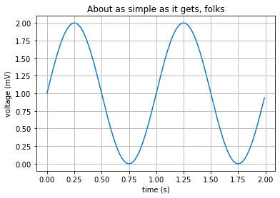
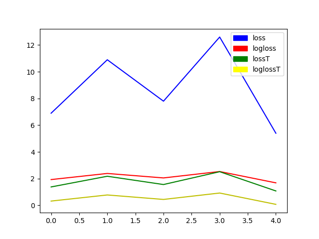
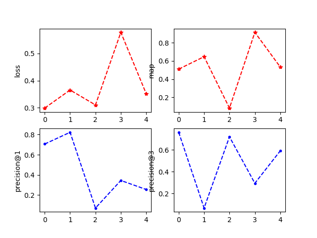
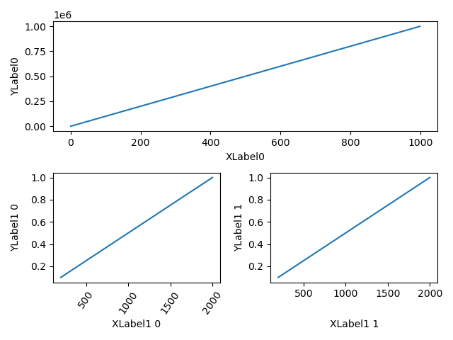
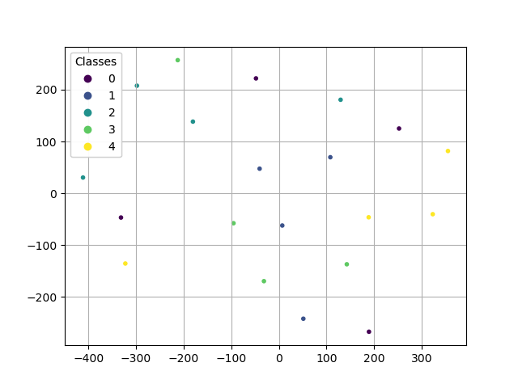
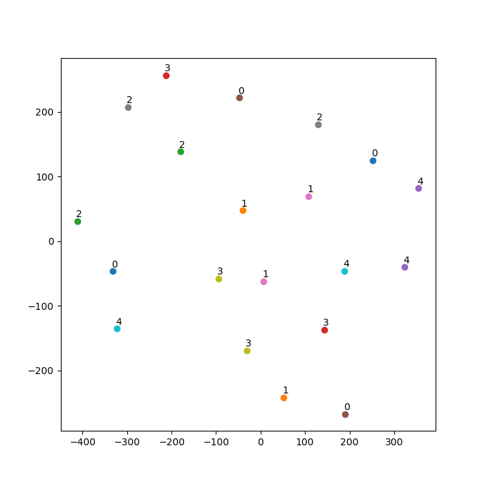
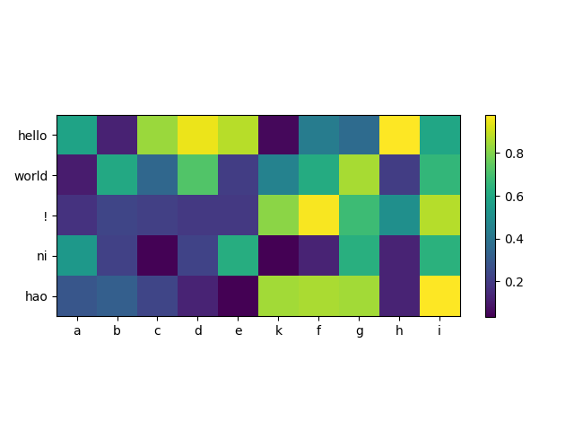
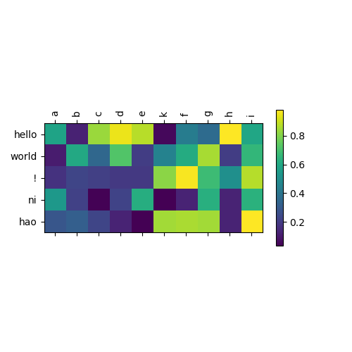

# 画函数

```python
import matplotlib
import matplotlib.pyplot as plt
# matplotlib.use('Agg')
import numpy as np

# Data for plotting
t = np.arange(0.0, 2.0, 0.01)
print(t)
s = 1 + np.sin(2 * np.pi * t)

fig, ax = plt.subplots()
ax.plot(t, s)

ax.set(xlabel='time (s)', ylabel='voltage (mV)',
       title='About as simple as it gets, folks')
ax.grid()

# fig.savefig("test.png")
plt.show()
```



# 一张图画多项指标曲线

```python
# legend图标
import matplotlib.pyplot as plt
import matplotlib.patches as mpatches
import math

total_losses = [6.9, 10.9, 7.8, 12.6, 5.4]
total_losses_T = [x/5.0 for x in total_losses]

# draw losses in log scale
loss_1 = plt.plot(total_losses, 'b-', label='loss')
loss_line = plt.plot([math.log(x) for x in total_losses], "r-", label="logloss")

loss_2 = plt.plot(total_losses_T, 'g-', label='lossT')
loss_line2 = plt.plot([math.log(x) for x in total_losses_T], "y-", label="loglossT")

blue_patch = mpatches.Patch(color='blue', label='loss')
red_patch = mpatches.Patch(color='red', label='logloss')
green_patch = mpatches.Patch(color='green', label='lossT')
black_patch = mpatches.Patch(color='yellow', label='loglossT')
plt.legend(handles=[blue_patch, red_patch, green_patch, black_patch])

plt.show()
plt.close()
```



# 绘制子图

```python
# subplot 多子图
import matplotlib.pyplot as plt
import numpy as np
# np.random.seed(5)

x = [i for i in range(5)]

plt.figure(1)
ax1 = plt.subplot(221)
ax1.plot(np.random.random_sample(5), marker='*', color="r", linestyle = "--")
ax1.set_ylabel("loss")

ax2 = plt.subplot(222)
ax2.plot(np.random.random_sample(5), marker='*', color='r', linestyle = "--")
ax2.set_ylabel("map")

ax3 = plt.subplot(223)
ax3.plot(np.random.random_sample(5), marker='.', color='b', linestyle = "--")
ax3.set_ylabel("precision@1")

ax4 = plt.subplot(224)
ax4.plot(np.random.random_sample(5), marker='.', color='b', linestyle = "--")
ax4.set_ylabel("precision@3")

plt.show()
```



```python
# subplot 多子图
import matplotlib.pyplot as plt
import numpy as np
import matplotlib.gridspec as gridspec

fig = plt.figure(tight_layout=True)
gs = gridspec.GridSpec(2, 2)

ax = fig.add_subplot(gs[0, :])
ax.plot(np.arange(0, 1e6, 1000))
ax.set_ylabel('YLabel0')
ax.set_xlabel('XLabel0')

for i in range(2):
    ax = fig.add_subplot(gs[1, i])
    ax.plot(np.arange(1., 0., -0.1) * 2000., np.arange(1., 0., -0.1))
    ax.set_ylabel('YLabel1 %d' % i)
    ax.set_xlabel('XLabel1 %d' % i)
    if i == 0:    # 横坐标的字符旋转
        for tick in ax.get_xticklabels():
            tick.set_rotation(55)
fig.align_labels()  # same as fig.align_xlabels(); fig.align_ylabels()

plt.show()
```



# embedding可视化

```python
from sklearn.manifold import TSNE
import matplotlib.pyplot as plt
import numpy as np

# 随机初始化10个样本，embedding_size=6
emb = np.random.rand(20,6)
labels = [0,1,2,3,4]*4

# 降维
tsne = TSNE(perplexity=10, n_components=2, init="pca", n_iter=5000)
low_dim_embs = tsne.fit_transform(emb)

```

```python
fig, ax = plt.subplots()

# plt.scatter(low_dim_embs[:,0], low_dim_embs[:,1], marker='.', c = labels)
scatter = ax.scatter(low_dim_embs[:,0], low_dim_embs[:,1], marker='.', c = labels)
legend1 = ax.legend(*scatter.legend_elements(), title="Classes")
ax.add_artist(legend1)

plt.grid()
plt.show()
```



```python
fig = plt.figure(figsize=(7, 7))
for i, label in enumerate(labels):
    x, y = low_dim_embs[i, :]
    plt.scatter(x, y)
    plt.annotate(label, xy=(x, y), xytext=(5,2), textcoords="offset points", ha="right", va="bottom")
# plt.savefig(out_path, format="svg")
plt.show()
```



# attention可视化

数据随机初始化，得到两个句子之间的attention矩阵。

```python
import torch
import numpy as np
import matplotlib.pyplot as plt
from matplotlib import ticker
plt.rcParams['font.sans-serif'] = 'Arial Unicode MS'

att = np.random.rand(5,10) # 问句长度分别为5，10

sentence = ["hello","world","!","ni","hao"]
pred_sentence = ["a","b","c","d","e","k","f","g","h","i"]

```

## imshow

```python
# plt.subplots(constrained_layout = True)
plt.axis('on')  # 刻度尺
plt.imshow(att, \
           cmap='viridis',
           vmax=att.max(),\
           vmin=att.min())  # 指定颜色显示范围  cmap颜色映射
plt.colorbar(shrink=0.5)   # shrink调整 色阶表的显示大小

plt.xticks(np.arange(len(pred_sentence)), pred_sentence)
plt.yticks(np.arange(len(sentence)), sentence)

# plt.xlabel('Attention')
plt.tight_layout()  # 自适应调整各个展示参数，是图像更契合（黑魔法：constrained 和 tight layout两种布局）
plt.show()
```



## matshow

```python
fig = plt.figure(figsize=(5, 5))
ax = fig.add_subplot(1, 1, 1)
im = ax.matshow(att, cmap='viridis')

ax.set_xticklabels([''] + pred_sentence, rotation=90)
ax.set_yticklabels([''] + sentence)

ax.xaxis.set_major_locator(ticker.MultipleLocator(1))  # 指定绘画刻度表的关键显示内容
ax.yaxis.set_major_locator(ticker.MultipleLocator(1))

fig.colorbar(im, shrink=0.5)

plt.show()
```



## 保存每轮epoch的结果

```python
fig, axs = plt.subplots(2, 1, sharex=True, sharey=True, figsize=(5, 5))
fig.subplots_adjust(hspace=0.1)
axs = axs.flatten()

def draw_map(ax, att, title):   #画热力图
    im = ax.imshow(att, \
                   cmap='viridis',
                   vmax=att.max(),\
                   vmin=att.min())
    ax.set_xlabel('epoch {}'.format(title))
    
    return im

for i in range(2):
    im = draw_map(axs[i], att, i)

plt.xticks(np.arange(len(pred_sentence)), pred_sentence)
plt.yticks(np.arange(len(sentence)), sentence)

# import ipdb;ipdb.set_trace()
# fig.colorbar(im1, ax=axs, orientation='horizontal')     #共享colorbar
plt.tight_layout()
plt.show()
```


